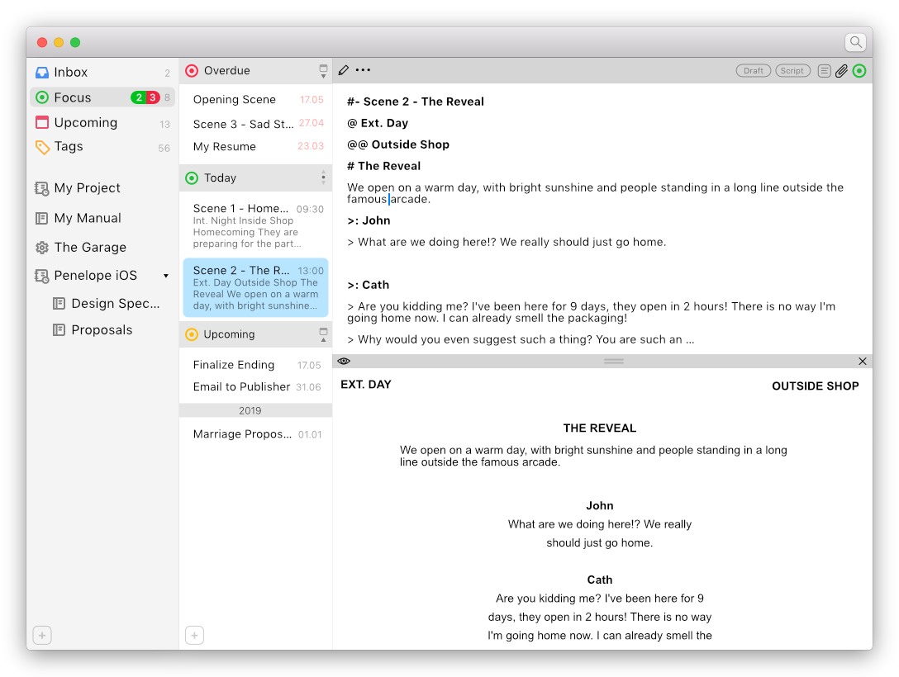

# Penelope
Penelope is a free, independent and open source macOS text management and editing tool.
Eventually Penelope will offer a number of very attractive features relating to writing and managing your notes.

##  Inbox
Any Note not directly associated with a Note Collection is saved to the Inbox. From there you can whenever it's convenient process the Note and assign it to either an existing Project or Notebook.

##  Focus
To help you focus and prioritise certain Notes you can enable its Focus state. This will make the Note appear in the Focus collection in the Organizer sidebar. Disabling Focus will remove the Note from the Focus collection. Simple.

Any Note added to a Project will automatically be associated with a timestamp (by default the creation date and time for the Note). When you modify this timestamp Penelope will automatically enable Focus mode for the Note, making it appear in the Focus collection under the appropriate section: Overdue, Today or Upcoming (if the date is in the future).

For example, you can assign a Note to the day before your son's birthday so it appears in Focus to remind you to write the speech, and having it eventually appear in Today to give you enough time to print the cue cards.

##  Upcoming
This Note Collection will show all Notes set to a date in the future, even if the Focus state is disabled for the Note. This means you'll get a complete overview of upcoming Notes that you may want to start focusing and working on.

##  Tags
Create and manage a meta structure for your notes. Find all notes related to a particular tag, despite them being in different Note Collections. You can do binary operations on the tags to exclude or require combinations of different tags. Save tag requirements as *Filters* for later use.

# Additional Details

## Projects
A Project ties your Notes to your calendar, which creates a timeline for your Notes. This makes *Penelope* perfect for documenting the evolution of a project. Notes can be assigned any date and time, which means Notes can be used for planning upcoming meetings, and writing meeting summaries - even long after the meeting has ended.

Things like product requirements, user stories and scenarios, evolve over time - which means you'll need to manage and keep track of these changes. Being able to easily browse all revisions makes that job a lot easier.

## Notebooks
Notebooks are not associated to a timeline. You will not be able to adjust the timestamp for a Note, which by extension will prevent a Note from appearing in the Upcoming and Focus view in the Organizer. In other words, every change to a Note is saved using the current timestamp on your Mac, and you won't be able to change that. Basically, create a Notebook whenever you'll only care about the most recent version of the Notes contained in the Notebook. (You can still access Note History, which allows you to link to a particular version of a Note in your other notes.)

## Markdown
Notes are written in plain text and saved as individual files in a user specified folder. Optionally the user can format a notes using <a href="https://en.wikipedia.org/wiki/Markdown">Markdown</a>. The editor will have realtime formatting and an optional live preview.

## Proper Note History
Modifying a note creates a new instance of it, all of which can be easily reviewed in Note History. You can also manually save a new Version of a Note which allows you to name the instance added to the history. All instances and versions of a note has a permanent link associated with it, allowing you to easily reference a specific revision in your other notes. This is critical as e.g. requirements change over time, yet you will want to be able to state in a meeting summary that all requirements have been implemented (and for that statement to remain true when reviewing the meeting summary later on).

## Graphs
Graphs are practical to visualize data, e.g. progress in a project. Which is why Penelope supports the creation of various graph types using a simple domain specific language (DSL). Every graph created can be included in any Note. Modifying a graph creates a new version of it, and similar to the Notes History, each graph version has a permanent link you can use anywhere in your notes.

## People and Assets
Easily specify assets or resources, like people and meeting rooms, and link them to your notes. This is great for meeting summaries, task assignments, progress follow-up, and so on.

## Note Templates
You can create Note Templates to make it easier to create consistent notes. A template is just a Note saved in a predefined folder specified in Application Preferences. Removing a template from the template folder will simply remove it from the list of Templates available when creating a new Note; and vice versa – adding a Note will make it appear as a Template option.

A template found in a subfolder within the Template folder means the template will only be available in a partiular Note Collection (the subfolder is named after the unique identifier of a Note Collection).

Templates can have special text placeholders which will make text entry even quicker. Normally the Tab key with add a text inset at the location of the cursor, however placeholders alter this behaviour: as long as there are placeholders in the Note, tapping Tab or Shift+Tab will jump to the next or previous Placeholder respectively. Replace all placeholders with actual text to regain the normal behavior of the Tab key.

## Note in a Note
You can insert a Note (child) inside another Note (parent) (which in the process forces you to decide how the inserted Note should be handled). The inserted Note will appear inline in its entirety. Use this feature to share for example the current version of a task list between multiple Notes - allowing you to easily update the task list from any of the files.

The inserted note can be set to Preview or Edit mode. Optionally you can set the child note to be frozen whenever a new version of the parent note is created (which means the dynamic link to the child is replaced with a specific permanent link). This way the parent note will add a version to its history that will not change even if the child note is further updated.

Nesting notes beyond one level is not supported, instead a link to the Note will appear.

